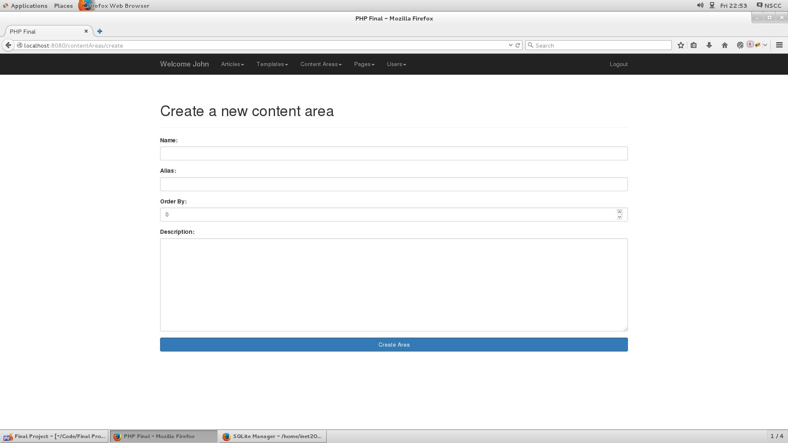
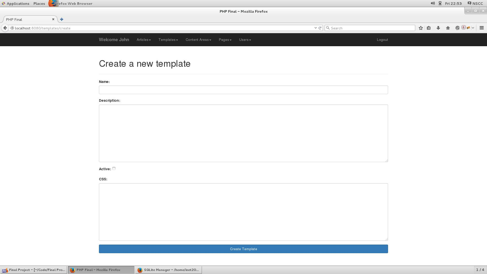

# PHP Final Project
Findlay Hiltchie &amp; Christian Hapgood

User Authentication

Add, edit, and organize content areas

Add, edit and organize pages

Create or edit users as an administrator

Create or edit users as an administrator

Create or edit articles or posts as an editor or author

Create or edit content areas as an editor or author

Create custom CSS templates for each content area or the page

Full CRUD capabilities 

